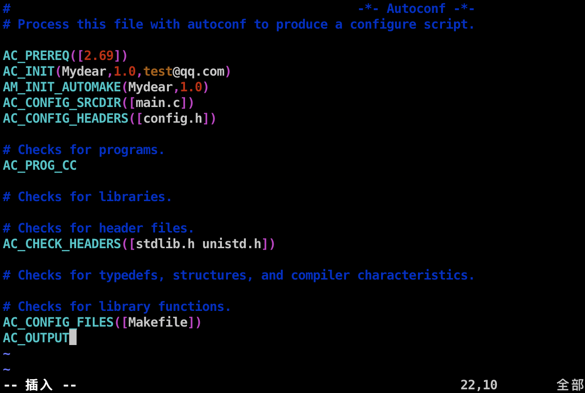
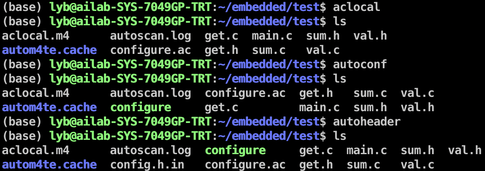
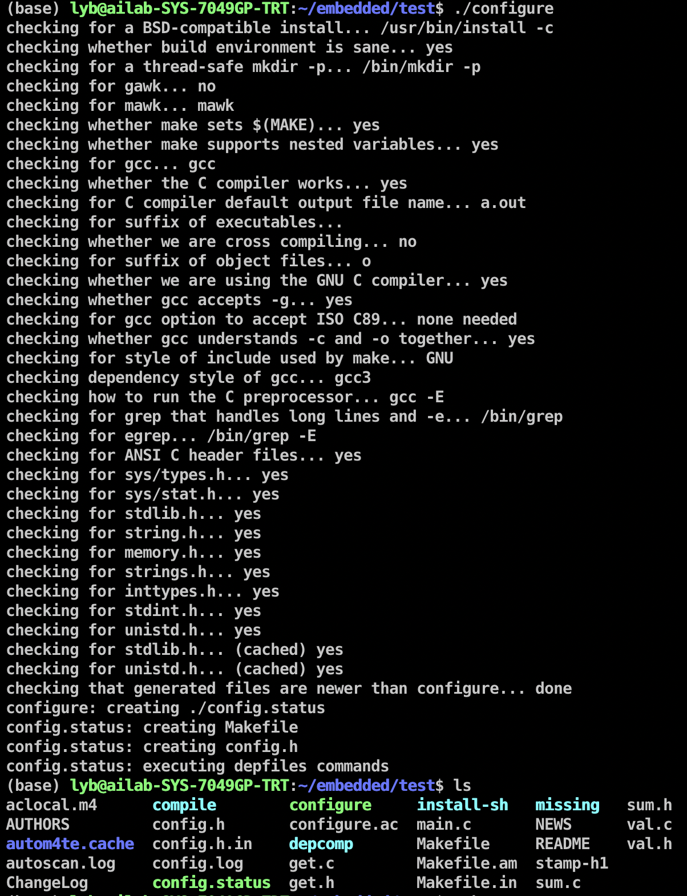
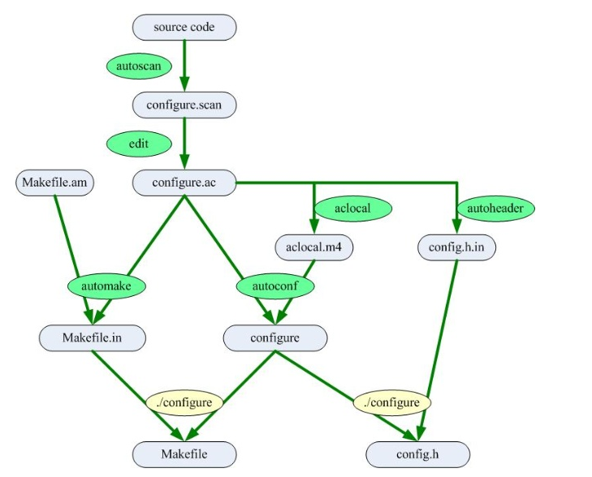

构建主机端开发环境
=======

<font size=3>小组名称：勇哥招亲组</font>

<font size=3>小组成员：赵勇、罗颖彪、杜佳卓</font>

- [一、实验目的](#jump1)
- [二、实验内容](#jump2)
- [三、实验过程与结果](#jump3)
- [四、实验总结](#jump4)
- [五、附实验源码](#jump5)

## <span id="jump1">一、实验目的</span>
* 在建立交叉编译开发平台之前，首先需要建立主机(虚拟机/PC，或双系统)开发环境;
* 学会使用本地gcc编译应用程序;
* 学会使用Makefile管理应用程序;
* 学会通过autotools生成Makefile，学会常用的make操作;
* 学会通过git/github管理团队软件和工作文件。<br>

## <span id="jump2">二、实验内容</span>

- 安装主机(虚拟机/PC)Linux开发环境，Fedora，Ubuntu，Debian均可;
- 编写C应用程序，通过本地gcc编译应用程序，如果是基于 x86的主机，gcc输出的执行文件运行的是x86指令集;
- 编写Makefile管理应用程序，为更好体现Makefile的作用， 需编写多个C程序，给出所创建的Makefile的内容;
- 通过autotools生成Makefile，完成常用的make操作(make, make install, make uninstall, make dist);
- 创建小组git仓库，github账号，用来存储小组工作文件以及小组报告;学习如何构建github文件，如何上传和下载 github文件等。

## 三、<span id="jump3">实验过程与结果</span>

### 3.1 安装主机开发环境Ubuntu

✅已完成

### 3.2 gcc应用

✅已完成

gcc介绍：GCC 编译器是 Linux 系统下最常用的 C/C++ 编译器，大部分 Linux 发行版中都会默认安装。GCC 编译器通常以`gcc`命令的形式在终端（Shell）中使用。

gcc使用：

1）生成**可执行程序：**

```bash
$ cd code
$ gcc main.c
```

打开 code 目录，会看到多了一个名为 a.out 的文件，这就是最终生成的可执行文件。

2）运行**可执行程序：**

```bash
$ ./a.out
```

​		`./`表示当前目录，整条命令的意思是运行当前目录下的 a.out 程序。如果不写`./`，Linux 会到系统路径下查找 a.out，而系统路径下显然不存在这个程序，所以会运行失败。

3）完整演示：

```bash
$ cd code  	    #进入源文件所在目录
$ touch main.c  #新建空白的源文件
$ vim main.c  	#编辑源文件
$ gcc main.c  	#生成可执行程序
$ ./a.out  	    #运行可执行程序
你好!
$   			#继续等待输入其它命令
```


> 自由软件的定义：“自由软件”尊重用户的自由，并且尊重整个社区。粗略来讲，一个软件如果是自由软件，这意味着**用户可以自由地运行，拷贝，分发，学习，修改并改进该软件**。因此，“自由软件”是关乎自由的问题，与价格无关，软件如何定价并不影响它是否被归类为自由软件。英文中，我们使用Free Software。由于Free一词既有自由，也有免费的意思。而Free Software中的Free是指“自由言论”中的自由，而非“免费”这一意项。为避免歧义，在使用英文时，我们也会借用法语或西班牙语的“Libre Software”来指自由软件。
>
> > 四项基本自由
> > - 自由度0：无论用户出于何种目的，必须可以按照用户意愿，自由地运行该软件。
> > - 自由度1：用户可以自由地学习并修改该软件，以此来帮助用户完成用户自己的计算。作为前提，用户必须可以访问到该软件的源代码。
> > - 自由度2：用户可以自由地分发该软件的拷贝，这样就可以助人。
> > - 自由度3：用户可以自由地分发该软件修改后的拷贝。借此，用户可以把改进后的软件分享给整个社区令他人也从中受益。作为前提，用户必须可以访问到该软件的源代码。
>
> 来源：[https://www.gnu.org/philosophy/free-sw.zh-cn.html](https://www.gnu.org/philosophy/free-sw.zh-cn.html)

### 3.3 Makefile使用

✅已完成

#### 3.3.1 Makefile介绍

代码变成可执行文件，叫做[编译](http://www.ruanyifeng.com/blog/2014/11/compiler.html)（compile）；先编译这个，还是先编译那个（即编译的安排），叫做[构建](http://en.wikipedia.org/wiki/Software_build)（build）。[Make](http://en.wikipedia.org/wiki/Make_(software))是最常用的构建工具，诞生于1977年，主要用于C语言的项目。但是实际上 ，任何只要某个文件有变化，就要重新构建的项目，都可以用Make构建。

#### 3.3.2 Makefile实例
（1）执行多个目标
```bash
.PHONY: cleanall cleanobj cleandiff

cleanall : cleanobj cleandiff
        rm program

cleanobj :
        rm *.o

cleandiff :
        rm *.diff
```
上面代码可以调用不同目标，删除不同后缀名的文件，也可以调用一个目标（cleanall），删除所有指定类型的文件。
（2）编译C语言项目
```bash
edit : main.o kbd.o command.o display.o
    cc -o edit main.o kbd.o command.o display.o

main.o : main.c defs.h
    cc -c main.c
kbd.o : kbd.c defs.h command.h
    cc -c kbd.c
command.o : command.c defs.h command.h
    cc -c command.c
display.o : display.c defs.h
    cc -c display.c

clean :
     rm edit main.o kbd.o command.o display.o

.PHONY: edit clean
```

### 3.4 autotools

✅已完成

#### 3.4.1 autotools介绍
GNU Autotools 一般指的是3个 GNU 工具包：Autoconf，Automake 和 Libtool (本文先介绍前两个工具，Libtool留到今后介绍)它们能解决什么问题，要先从 GNU 开源软件的 Build 系统说起。一般来说。GNU 软件的安装过程都是：

1. 解压源代码包
2. ./configure
3. make
4. make install

这个过程中， 需要有一个 configure 脚本，同时也需要一个 Makefile 文件。而 Autoconf 和 Automake 就是一套自动生成 configure 脚本和 Makefile 文件的工具。

#### 3.4.2 autotools使用
（1）创建源文件，在test目录下包含若干C文件和相应头文件；<br>
（2）自动扫描目录，运行autoscan命令扫描目录test，生成 configure.scan 文件。该目录下会多出 autoscan.log和configure.scan两个文件；<br>
（3）创建configure.ac文件，将configure.scan重命名为configure.ac；

（4）编辑configure.ac文件，首先打开configure.ac文件：

修改为：

configure.ac标签说明：<br>

|       标签       | 说明                                                         |
| :--------------: | ------------------------------------------------------------ |
|    AC_PREREQ     | 声明autoconf要求的版本号                                     |
|     AC_INIT      | 定义软件名称、版本号、联系方式                               |
| AM_INIT_AUTOMAKE | 必须要的，参数为软件名称和版本号                             |
| AC_CONFIG_SCRDIR | 宏用来侦测所指定的源码文件是否存在, 来确定源码目录的有效性。此处为当前目录下main.c。 |
| AC_CONFIG_HEADER | 宏用于生成config.h文件，以便 autoheader 命令使用。           |
|    AC_PROG_CC    | 指定编译器，默认GCC                                          |
| AC_CONFIG_FILES  | 生成相应的Makefile文件，不同文件夹下的Makefile通过空格分隔。例如：AC_CONFIG_FILES([Makefile, src/Makefile]) |
|    AC_OUTPUT     | 用来设定 configure 所要产生的文件，如果是makefile，configure 会把它检查出来的结果带入makefile.in文件产生合适的makefile。 |

（5）使用aclocal命令扫描 configure.ac 文件，生成 aclocal.m4 文件, 获取 autoconf 创建 configure 所需的宏定义。该文件主要处理本地的宏定义，它根据已经安装的宏、用户定义宏和 acinclude.m4 文件中的宏将 configure.ac 文件需要的宏集中定义到文件 aclocal.m4 中;

（6）使用autoconf命令读取 configure.ac文件中的宏，生成configure脚本。这个过程可能要用到aclocal.m4中定义的宏；

（7）使用autoheader命令生成config.h.in文件，该命令通常会从 "acconfig.h” 文件中复制用户附加的符号定义。该例子中没有附加的符号定义, 所以不需要创建 "acconfig.h” 文件：



（8）手工创建Makefile.am文件。automake根据configure.ac的参数把 Makefile.am转换成 Makefile.in文件。最终通过Makefile.in生成Makefile文件，所以<font color='red'>Makefile.am这个文件非常重要，定义了一些生成Makefile的规则：</font>


说明：

1. **AUTOMAKE_OPTIONS**：由于GNU对自己发布的软件有严格的规范，比如必须附带许可证声明文件COPYING等，否则automake执行时会报错。automake提供了3种软件等级：foreign，gnu和gnits，供用户选择。默认级别是gnu。在本例中，使用了foreign等级，它只检测必须的文件。

2. **bin_PROGRAMS = Mydear**：生成的可执行文件名称，生成多个可执行文件，可以用空格隔开。

3. **Mydear_SOURCES**：生成可执行文件Mydear需要依赖的源文件。其中Mydear为可执行文件的名称。

（9）执行**automake** **--add-missing**命令。该命令生成 Makefile.in 文件。使用选项 "--add-missing" 可以让 Automake 自动添加一些必需的脚本文件。如果发现一些文件不存在，可以通过手工 touch命令创建。


（10）大部分linux软件安装都先需要执行./congigure，然后执行make和make install命令。./congigure主要把 Makefile.in 变成最终的 Makefile 文件。configure会把一些配置参数配置到Makefile文件里面。



（11）执行make命令，执行make命令后，就生成了可执行文件**Mydear**：


（12）测试make生成的目标文件是否正确:


（13）make install，make uninstall。 可执行文件安装与卸载。

（14）make dist 用于生成软件压缩包。生成结果如下：


#### 3.4.3 Autotools运行流程

流程总结：

1. 执行autoscan命令。这个命令主要用于扫描工作目录，并且生成configure.scan文件。

2. 修改configure.scan为configure.ac文件，并且修改配置内容。

3. 执行aclocal命令。扫描 configure.ac 文件生成 aclocal.m4文件。

4. 执行autoconf命令。这个命令将 configure.ac 文件中的宏展开，生成 configure 脚本。

5. 执行autoheader命令。该命令生成 config.h.in 文件。

6. 新增Makefile.am文件，修改配置内容

7. 执行automake --add-missing命令。该命令生成 Makefile.in 文件。

8. 执行 ./congigure命令。将Makefile.in命令生成Makefile文件。

9. 执行make命令。生成可执行文件。

  


如何使用发布的文件：

1. 下载到“Mydear-1.0.tar.gz”压缩文档

2. 使用“ tar -zxvf Mydear-1.0.tar.gz ”命令解压

3. 使用 “./configure” 命令，主要是生成Makefile命令，已经一些配置初始化。

4. 使用 “make” 命令编译源代码文件生成软件包。

5. 使用“make install ”命令来安装编译后的软件包到系统中。

### 3.5 创建小组git仓库

✅已完成

## <span id="jump4">四、实验总结</span>

### 4.1 实验收获

熟悉和掌握了Makefile和autotools的使用

### 4.2 未解决问题

✅无

## <span id="jump5">五、附实验源码</span>

✅见C_code和test文件夹

参考链接：

1. [Make命令教程](http://www.ruanyifeng.com/blog/2015/02/make.html)
2. [Autotools使用详细解读](https://blog.csdn.net/initphp/article/details/43705765)
